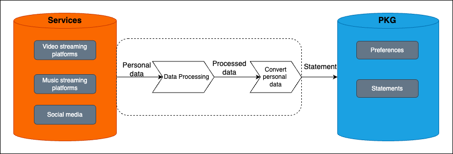

# Automatic Population of Personal Knowledge Graphs from Streaming Platforms
<u style="text-decoration: none; -webkit-text-decoration-color: blue; text-decoration-color: blue;"></u>

The automatic population of a Personal Knowledge Graph based on personal data from streaming platforms is a solution that takes the user's personal data as input, processes it, carries out entity linking, and populates the user's PKG. Eirik Wilhelmsen and Ottar Jensen proposed The solution as part of a bachelor's project. The method is based on concepts such as PKG, Knowledge Bases (KBs), Entity Linking (EL), and Information Extraction (IE), all of which are examined and described in our thesis. The proposed solution is based on an already existing system called PKG-API, https://github.com/iai-group/pkg-api. The PKG API takes care of populating the PKG, while the method we have created stands for the content of what will populate the PKG.

The method's course of action consists of 3 steps respectively, illustrated in the figure below.
1. Extract personal data from services
2. Process the personal data
   1. Keep only the important bits of information (what the user likes, dislikes, etc)
   2. Entity link provided entities
        1. Search entities through KBs like Music Brainz and IMDb for corresponding entries
3. Convert data into a format acceptable for the PKG framework

*The course of action of the proposed method*

## Entity Linking
<u style="text-decoration: none; -webkit-text-decoration-color: blue; text-decoration-color: blue;"></u>
Entity linking (EL) is a big part of our development. EL involves searching for corresponding entities in a KB. We use the KBs Music Brainz for songs and OMDb and IMDb for movies. `search_artist()` from SpotifyClass.py shows how the Music Brainz API could search artists and songs to retrieve their respective URIs. `search_OMDb()` shows how the movie IMDb ID could be retrieved as well as three related actors, and `get_actor_imdb_id` shows how to get the URI for those three actors.

### Starting the program

The requirements must be downloaded to start the program. The program runs on localhost:7000. The PKG API must run in the background; read more about how at https://github.com/iai-group/pkg-api. Branch out to a premade **demo** branch and type `Python app.py` inside the PKGs folder. Using your own files must be the exact files from the services. Otherwise, you can choose the test functionality that automatically uploads from a test file. The test functionality will not populate any PKG and is only for visualization.

Note that the Spotify API is unavailable unless a request is sent to Eirik with a Spotify email, and he adds you.

Contributors:

Eirik Wilhelmsen created EntityLinking.html, netflix.html, spotify.html, GroundTruthNetflix.py, GroundTruthSpotify.py, NetflixClass.py, PKGClass.py, SpotifyClass.py

Ottar Jensen created applemusic.html, AppleMusic.py, GroundTruthAppleM.py

Worked together on:

app.py, Statements.py, index.html, AppleMusic.py, GroundTruthAppleM.py

